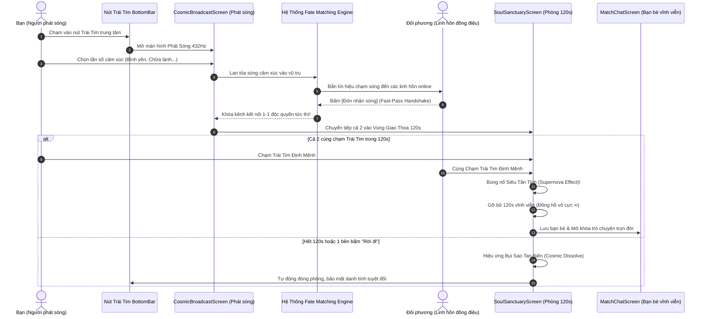

# Hướng Dẫn Tính Năng: Nút Trái Tim Trung Tâm (Cosmic Resonance 432Hz & Soul Sanctuary 120s)

> **Tài liệu đặc tả tính năng & hướng dẫn sử dụng chức năng Nút Trái Tim tại thanh điều hướng trung tâm (Hero Center Button) trong FateLink.**

---

## 1. Giới Thiệu & Triết Lý Thiết Kế (Product Philosophy)

Nút Trái Tim phát sáng ở chính giữa thanh Bottom Navigation Bar (`CustomBottomNavBar`) là **Linh Hồn & Giá Trị Cốt Lõi (Core USP)** của FateLink. 

Khác với các ứng dụng hẹn hò hay kết bạn thông thường:
- **Không quẹt thẻ hời hợt (No Swipe Addiction):** Không đánh giá con người chỉ qua ngoại hình.
- **Không tìm kiếm ngẫu nhiên vô định (No Blind Chat Clones):** Không giống như Litmatch hay Omegle ghép cặp bừa bãi và trò chuyện khô khan.
- **Kết nối dựa trên Tần Số Rung Động & Cảm Xúc (Cosmic Resonance):** Người dùng tìm thấy nhau dựa trên tần số âm học tự nhiên (432Hz, 528Hz...), tâm trạng thực tế trong ngày, và độ tương hợp tâm hồn định mệnh.

---

## 2. Sơ Đồ Luồng Hoạt Động (Architecture & Flowchart)



---

## 3. Các Giai Đoạn Trải Nghiệm Chi Tiết

### 3.1. Giai Đoạn 1: Phát Sóng Vũ Trụ 432Hz (`CosmicBroadcastScreen`)
- **Khởi động:** Nhấn vào nút **Trái Tim màu đỏ/hồng** ở chính giữa thanh Bottom Navigation Bar.
- **Giao diện:** Toàn cảnh thiên hà sâu thẳm với hiệu ứng các vòng sóng âm lan tỏa từ Avatar người dùng theo nhịp thở 432Hz (`Ripple Pulse Animation`) kết hợp phản hồi rung nhịp tim (`HapticFeedback.lightImpact`).
- **Chọn tần số cảm xúc (Mood Selector):**
  - 🍃 **Bình yên (432Hz):** Thư thái, lắng đọng sau ngày dài.
  - ✨ **Chữa lành (528Hz):** Tần số phục hồi năng lượng và chuyển hóa cảm xúc.
  - 🌙 **Đêm muộn (396Hz):** Giải tỏa nỗi cô đơn giữa màn đêm sâu thẳm.
  - 💫 **Tìm tri kỷ (639Hz):** Kết nối sự thấu cảm sâu sắc giữa hai linh hồn.
  - 🌊 **Lắng nghe (741Hz):** Tìm một người biết sẻ chia chân thành.

### 3.2. Giai Đoạn 2: Giải Quyết Bài Toán "Nhiều Người Cùng Nhận Sóng" (Fast-Pass Handshake 1-1)
- **Vấn đề đặt ra:** *"Nếu phát tín hiệu mà nhiều người cùng nhận được và cùng nhắn tin thì sẽ bị loạn luồng trò chuyện?"*
- **Giải pháp độc bản của FateLink:**
  1. Tín hiệu được phát ngầm đến các vệ tinh linh hồn lân cận đang online có cùng cảm xúc và độ tương hợp cao nhất.
  2. Màn hình của họ hiện thông báo chạm sóng mờ ảo.
  3. **Cơ chế Fast-Pass Handshake:** Người đầu tiên bấm **[Đón nhận sóng]** sẽ lập tức **KHÓA KÊNH 1-1 ĐỘC QUYỀN** với bạn!
  4. Những người bấm sau sẽ nhận thông báo tinh tế: *"Tần số này vừa tìm thấy tri kỷ đồng điệu! Đang tiếp tục quét vệ tinh tiếp theo..."*. Điều này tạo ra hiệu ứng **FOMO định mệnh** (Cơ hội chỉ đến một lần, ai mở lòng trước thì định mệnh mỉm cười!).
  5. Màn hình của bạn lập tức hiển thị thông báo: *"✨ Đã bắt được tần số đồng điệu của [Tên đối phương] (Tương hợp 96%)! Kênh 1-1 đã được khóa độc quyền."* và chuyển vào phòng giao thoa.

### 3.3. Giai Đoạn 3: Vùng Giao Thoa Linh Hồn 120 Giây (`SoulSanctuaryScreen`)

#### A. Đồng Hồ Đếm Ngược Định Mệnh (Cosmic Countdown Ring)
- Thời gian đếm ngược chính xác từ `02:00` xuống `00:00`.
- Khi thời gian còn dưới `30 giây`, vòng đồng hồ chuyển sang màu hồng ấm nhấp nháy cùng nhịp rung haptic để nhắc nhở người dùng đưa ra quyết định định mệnh.

#### B. Avatar Sương Mù Mờ Ảo (Mist Blur Identity)
- Khuôn mặt đối phương ban đầu được bao bọc bởi lớp kính mờ bí ẩn (`ImageFilter.blur sigma: 18.0`).
- **Cơ chế mở khóa qua sự chân thành:** Mỗi khi hai bên gửi tin nhắn trò chuyện, độ mờ sương mù giảm dần từng bước (`sigma` giảm từ 18.0 về 0.0), kèm thanh tiến trình trực quan:  
  *Độ tỏ tường tâm hồn: 20% ➔ 50% ➔ 80% ➔ 100%*.
- Sau khoảng 5-6 câu nói chân thành, chân dung đối phương dần hiện rõ một cách kỳ diệu!

#### C. Thẻ Phá Băng Cảm Xúc (Cosmic Icebreaker Prompt)
- Nằm ở đầu cuộc trò chuyện để loại bỏ hoàn toàn sự lúng túng lúc ban đầu.
- Gợi ý câu hỏi sâu lắng do AI chọn riêng (VD: *"Nếu tối nay có thể gác lại mọi âu lo, bạn muốn đi dạo ở đâu nhất?"*).
- Nút **[Chạm để trả lời gợi ý này]** giúp điền nhanh vào ô nhập để gửi ngay.

#### D. Cơ Chế Khóa Định Mệnh Đôi (Double Heart Sync)
- Nút Trái Tim phát sáng ở góc dưới thanh nhập tin nhắn.
- **Khi Bạn Bấm:** Nút tim phóng to đập rộn ràng, đổi sang màu đỏ hồng rực rỡ, kèm thông báo:  
  *❤️ "Bạn đã gửi rung động tim! Đang đợi đối phương cùng chạm tim..."*
- **Khi Cả Hai Cùng Bấm:**
  - Kích hoạt **Hiệu Ứng Siêu Tân Tinh (Supernova Particle Explosion)**: Hàng chục hạt ánh sao bùng nổ toàn màn hình với chuyển động vật lý thiên văn.
  - Đồng hồ 120s chuyển sang trạng thái **VÔ HẠN (`∞`)**!
  - Lớp sương mù biến mất hoàn toàn, danh tính lộ diện.
  - Xuất hiện Modal chúc mừng:  
    *🎉 "KẾT NỐI ĐỊNH MỆNH THÀNH CÔNG! Giới hạn 120s đã được gỡ bỏ vĩnh viễn. Hai bạn đã chính thức là bạn bè tri kỷ!"*
  - Cho phép bấm **[Tiếp tục trò chuyện vĩnh viễn 🚀]** để chuyển sang phòng chat bạn bè dài hạn ([MatchChatScreen](file:///Users/peggy2402/Projects/fatelink/fatelinkfe/lib/presentation/screens/match/match_chat_screen.dart)).

#### E. Kịch Bản An Yên (Cosmic Dissolve)
- Nếu hết 120 giây mà cả hai chưa cùng thả tim, hoặc một trong hai bên bấm nút **[Rời đi]**:
  - Hộp thoại an yên xuất hiện: *"Thời gian kết nối 120s đã kết thúc. Sóng định mệnh này đã hòa vào ngân hà bao la. Chúc bạn luôn an yên!"*
  - Màn hình tự động đóng lại nhẹ nhàng, không lưu lại lịch sử tin nhắn rác, bảo vệ quyền riêng tư tuyệt đối cho cả hai.

---

## 4. Hướng Dẫn Sử Dụng Nhanh (User Quick Guide)

| Bước | Thao Tác | Ý Nghĩa / Kết Quả |
| :--- | :--- | :--- |
| **1** | Nhấn **Nút Trái Tim** ở chính giữa thanh Bottom Menu | Mở màn hình Phát Sóng Tâm Hồn 432Hz |
| **2** | Chọn **Tần số tâm trạng** mong muốn (ở dưới đáy) | Hệ thống tự động quét và gửi sóng tương thích |
| **3** | Đợi 2-5 giây để hệ thống tìm đối phương | Bắt sóng thành công & Khóa kênh 1-1 độc quyền |
| **4** | Bước vào **Phòng Giao Thoa 120s** | Đọc câu hỏi phá băng & bắt đầu trò chuyện ẩn danh |
| **5** | Gửi tin nhắn qua lại | Màn sương trên Avatar tan dần theo từng tin nhắn |
| **6** | Chạm vào **Nút Trái Tim nhỏ** cạnh ô nhập tin nhắn | Thể hiện mong muốn trở thành bạn bè dài hạn |
| **7** | Khi cả hai cùng chạm tim | **Supernova bùng nổ**, kết nối định mệnh thành công! |

---

## 5. Tài Liệu Kỹ Thuật Dành Cho Lập Trình Viên (Developer Reference)

### 5.1. Danh Sách Tệp Mã Nguồn Liên Quan

- **Thanh Điều Hướng & Trigger:**
  - [custom_bottom_nav_bar.dart](file:///Users/peggy2402/Projects/fatelink/fatelinkfe/lib/presentation/widgets/custom_bottom_nav_bar.dart): Chứa nút tròn Trái Tim trung tâm và callback `onHeartTap`.
  - [main_screen.dart](file:///Users/peggy2402/Projects/fatelink/fatelinkfe/lib/presentation/screens/main_screen.dart): Điều hướng từ `onHeartTap` sang `CosmicBroadcastScreen`.
- **Màn Hình Tính Năng Mới:**
  - [cosmic_broadcast_screen.dart](file:///Users/peggy2402/Projects/fatelink/fatelinkfe/lib/presentation/screens/match/cosmic_broadcast_screen.dart): Quản lý luồng phát sóng, bộ chọn tâm trạng, Animation phát sóng đồng tâm và cơ chế Fast-Pass 1-1.
  - [soul_sanctuary_screen.dart](file:///Users/peggy2402/Projects/fatelink/fatelinkfe/lib/presentation/screens/match/soul_sanctuary_screen.dart): Quản lý phòng chat 120s, bộ đếm ngược `Timer`, hiệu ứng sương mù `ImageFilter.blur`, câu hỏi phá băng và hiệu ứng Siêu Tân Tinh `_SupernovaPainter`.
- **Màn Hình Chat Chính Thức:**
  - [match_chat_screen.dart](file:///Users/peggy2402/Projects/fatelink/fatelinkfe/lib/presentation/screens/match/match_chat_screen.dart): Màn hình chat bạn bè dài hạn sau khi đã mở khóa định mệnh.

### 5.2. Các Thông Số Cấu Hình Quan Trọng

```dart
// Thời lượng phòng giao thoa
static const int _initialDuration = 120; // 120 giây (2 phút)

// Độ mờ sương mù ban đầu của Avatar
double _currentBlur = 18.0; 

// Tốc độ tan biến sương mù mỗi tin nhắn
_currentBlur = math.max(0.0, _currentBlur - 3.2);

// Tần số sóng âm âm học
Bình yên: 432Hz | Chữa lành: 528Hz | Đêm muộn: 396Hz | Tìm tri kỷ: 639Hz | Lắng nghe: 741Hz
```

---

*Tài liệu được cập nhật tự động vào hệ thống tài liệu dự án FateLink.*
