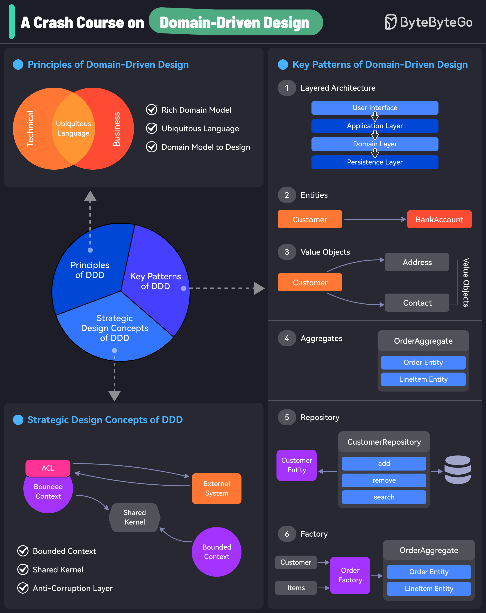

# Hướng Dẫn Kiến Trúc Backend

Tài liệu này mô tả ngắn gọn kiến trúc của `fatelink-be` và cách project đang áp dụng `DDD` cùng `Clean Architecture`.

## 1. Project này đang đi theo hướng gì?

`fatelink-be` đang đi theo hướng:

- `DDD` ở mức thực dụng: chia theo `bounded context`
- `Clean Architecture`: tách lớp để business rule nằm ở trung tâm
- `modular monolith`: một backend duy nhất, nhưng chia module rõ để dễ bảo trì

Hiểu ngắn gọn:

- mỗi `context` là một cụm nghiệp vụ riêng
- mỗi context có `domain`, `application`, `infrastructure`, `presentation`
- code ngoài đi vào trong, không để business rule phụ thuộc framework hoặc DB

## 2. Ảnh minh họa nên nhìn trước

### DDD + Clean Architecture



Nguồn: ByteByteGo, `A Crash Course on Domain-Driven Design`
https://blog.bytebytego.com/p/a-crash-course-on-domain-driven-design

Ảnh này phù hợp để đọc nhanh các khái niệm chính của `DDD`:

- `ubiquitous language`
- `bounded context`
- `ACL`, `shared kernel`
- `entity`, `value object`, `aggregate`, `repository`

### Clean Architecture cổ điển


Nguồn: Robert C. Martin, `The Clean Architecture`
https://blog.cleancoder.com/uncle-bob/2011/11/22/Clean-Architecture.html

Ảnh này nhấn mạnh quy tắc quan trọng nhất:

- dependency phải hướng vào trong
- lớp trong không được biết lớp ngoài

## 3. Vì sao project chọn Clean Architecture?

Project này dùng `Clean Architecture` vì backend có nhiều mảng nghiệp vụ và sẽ còn thay đổi tiếp:

- thêm API mới
- đổi cách lưu dữ liệu
- thay provider ngoài như AI, auth, notifier
- mở rộng flow nghiệp vụ theo từng context

Nếu business rule dính chặt vào controller, framework hoặc repository implementation thì mỗi lần đổi kỹ thuật sẽ kéo theo sửa logic nghiệp vụ. Về lâu dài rất dễ rối.

`Clean Architecture` được dùng để tách phần:

- `cái hệ thống làm`
- khỏi `cách hệ thống được cài bằng công nghệ nào`

Nói ngắn gọn:

- business rule phải sống lâu hơn framework
- DB, HTTP, NestJS, third-party service chỉ là chi tiết ngoài rìa

## 4. Ưu điểm của Clean Architecture trong project này

Các lợi ích thực tế:

- `dễ bảo trì hơn`: nhìn vào context sẽ biết business rule nằm ở đâu, adapter nằm ở đâu
- `giảm coupling`: đổi repository hoặc external service ít ảnh hưởng lõi nghiệp vụ hơn
- `dễ test hơn`: có thể test use case và domain mà không cần chạy full HTTP hay DB thật
- `dễ mở rộng hơn`: khi thêm flow mới, có chỗ rõ ràng để đặt use case, orchestrator, contract
- `giữ boundary rõ hơn`: mỗi context không bị kéo implementation chi tiết của context khác vào
- `đỡ lệ thuộc framework`: NestJS giúp wiring tốt, nhưng không nên trở thành nơi chứa nghiệp vụ

Điều quan trọng là `Clean Architecture` không được dùng vì “cho đẹp”, mà vì nó giúp project kiểm soát độ phức tạp khi số context và số use case tăng dần.

## 5. DDD trong project này được hiểu như thế nào?

Trong project này, `DDD` không có nghĩa là làm mọi pattern thật nặng. Nó chủ yếu có nghĩa là:

- chia hệ thống theo `bounded context`
- mỗi context sở hữu business rule của mình
- context khác muốn dùng hành vi của nó thì đi qua contract rõ ràng

Các context hiện tại:

- `auth`
- `users`
- `chat`
- `matching`
- `support`
- `ai`
- `admin`

Điểm quan trọng nhất của DDD ở đây là `ranh giới`.

Ví dụ:

- `users` sở hữu logic liên quan người dùng
- `chat` không nên import thẳng use case concrete nội bộ của `users`
- nếu `chat` cần gọi sang `users`, nó nên đi qua public contract

## 6. Clean Architecture trong project này được hiểu như thế nào?

Mỗi context được tổ chức theo các lớp chính:

```text
context-name/
  domain/
  application/
  infrastructure/
  presentation/
  composition/
```

Ý nghĩa:

- `domain`: entity, value object, domain rule, repository contract
- `application`: use case, contract, orchestrator
- `infrastructure`: repository implementation, database model, external adapter
- `presentation`: controller, gateway, DTO, Swagger docs
- `composition`: module, provider, token wiring của NestJS

Quy tắc phụ thuộc:

- `presentation` gọi `application`
- `application` dùng `domain`
- `infrastructure` implement các port/repository cho lớp trong dùng
- `domain` không phụ thuộc NestJS, controller, Mongo model hay SDK ngoài

## 7. Cách map lý thuyết đó vào codebase này

### Bounded context

Project đang chia rõ theo thư mục:

- `src/contexts/auth`
- `src/contexts/users`
- `src/contexts/chat`
- `src/contexts/matching`
- `src/contexts/support`
- `src/contexts/ai`
- `src/contexts/admin`

Đây chính là lớp áp dụng `DDD strategic design` ở mức codebase.

### Application contract

Khi một context cần expose capability cho context khác:

- contract nên nằm trong `application/contracts`
- context dùng tới chỉ phụ thuộc contract đó
- wiring thực tế đi qua token

Đây là cách giữ boundary sạch hơn so với việc inject trực tiếp concrete class.

### Domain rule

Business rule nên ưu tiên nằm ở:

- entity
- value object
- domain service

Use case nên tập trung vào:

- nhận input
- load dữ liệu
- gọi domain behavior
- persist
- trả kết quả

### Infrastructure là chi tiết kỹ thuật

Repository implementation, database model, Google auth adapter, AI provider adapter đều là lớp ngoài. Chúng phục vụ business rule, không nên điều khiển business rule.

## 8. Các quy ước kiến trúc đang dùng

- Token mới nên dùng token local theo context, không mở rộng `APPLICATION_TOKENS` cho code mới.
- Swagger nên tách sang `presentation/http/docs/*.swagger.ts`, không nhồi dài trong controller.
- Workflow lớn nên tách sang `application/services/*orchestrator.ts`, không để một use case phình quá to.
- Cross-context interaction nên đi qua `application contract`, không đi qua concrete implementation.

## 9. Khi đọc một context trong project

Nên đọc theo thứ tự:

1. `composition/*.module.ts`
2. `presentation/*`
3. `application/usecases/*`
4. `application/contracts/*`
5. `application/services/*`
6. `domain/*`
7. `infrastructure/*`

Thứ tự này giúp nhìn đúng luồng:

- API vào từ đâu
- use case nào xử lý
- business rule nằm ở đâu
- repository hay external adapter nào đang phục vụ nó

## 10. Tóm tắt ngắn

Nếu chỉ nhớ 4 ý, hãy nhớ:

- `DDD`: chia đúng ranh giới nghiệp vụ
- `Clean Architecture`: giữ business rule ở trung tâm
- `Dependency direction`: phụ thuộc đi vào trong
- `Project này`: đang là modular monolith chia theo bounded context

## Nguồn ảnh

- ByteByteGo, “A Crash Course on Domain-Driven Design”: https://blog.bytebytego.com/p/a-crash-course-on-domain-driven-design
- Robert C. Martin, “Clean Architecture”: https://blog.cleancoder.com/uncle-bob/2011/11/22/Clean-Architecture.html
